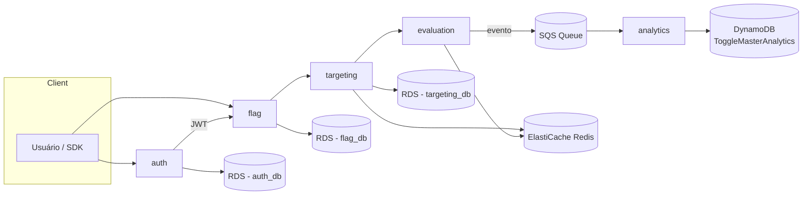

# ToggleMaster — Tech Challenge Fase 3

Plataforma de feature flags (ToggleMaster) composta por 5 microsserviços em Go,
provisionada 100% via Terraform na AWS (EKS, RDS, ElastiCache, DynamoDB, SQS, ECR),
com pipelines de CI/DevSecOps no GitHub Actions e entrega contínua via GitOps (ArgoCD).

## Arquitetura



## Estrutura do repositório

```
togglemaster/
├── infra/                # Terraform (IaC) — módulos + ambiente dev
├── services/             # 5 microsserviços Go (auth, flag, targeting, evaluation, analytics)
├── .github/workflows/    # Pipelines de CI/DevSecOps (por serviço)
├── gitops/                # Manifestos Kubernetes (Kustomize) + Applications do ArgoCD
├── scripts/               # Scripts auxiliares (sync de secrets, bootstrap)
└── docs/                  # Documentação complementar
```

## Pré-requisitos

- Terraform >= 1.7
- AWS CLI configurado com uma conta pessoal (esta entrega **cria roles de IAM via Terraform**,
  não usa AWS Academy / LabRole)
- kubectl, helm
- Go >= 1.22, Docker

## 1. Provisionar a infraestrutura

```bash
cd infra
# 1. Crie o bucket S3 (e tabela de lock, se optar por DynamoDB) para o backend remoto
#    OU utilize use_lockfile (S3 native locking) conforme backend.hcl.example
cp backend.hcl.example backend.hcl   # edite com o nome do seu bucket
terraform init -backend-config=backend.hcl

cp terraform.tfvars.example terraform.tfvars   # ajuste conforme necessário
terraform plan -var-file=terraform.tfvars
terraform apply -var-file=terraform.tfvars
```

Isso provisiona: VPC/Subnets, Cluster EKS + Node Group, 3 RDS PostgreSQL,
1 ElastiCache Redis, 1 tabela DynamoDB, 1 fila SQS, 5 repositórios ECR e o ArgoCD
(via provider Helm) já apontando para a pasta `gitops/`.

Atualize seu kubeconfig:

```bash
aws eks update-kubeconfig --name $(terraform output -raw eks_cluster_name) --region <sua-regiao>
```

## 2. Sincronizar credenciais dos bancos (sem texto plano no Git)

As senhas dos RDS são geradas aleatoriamente pelo Terraform e armazenadas no
AWS Secrets Manager (nunca em arquivos de texto ou no repositório). Para criar
os Secrets do Kubernetes consumidos pelos serviços:

```bash
./scripts/sync-db-secrets.sh
```

## 3. Preencher os placeholders do GitOps

Os manifestos em `gitops/` contêm placeholders que dependem dos outputs do
Terraform (só existem após o primeiro `apply`). Substitua e faça commit/push:

| Placeholder                     | Onde                                                    | Origem                                         |
|----------------------------------|----------------------------------------------------------|-------------------------------------------------|
| `<ECR_REGISTRY>`                 | `gitops/apps/*/deployment.yaml`                          | `terraform output ecr_repository_urls`          |
| `<GITOPS_REPO_URL>`               | `gitops/argocd/applications/*.yaml`                      | URL HTTPS do seu repositório GitHub              |
| `<REDIS_PRIMARY_ENDPOINT>`        | `gitops/apps/targeting/configmap.yaml`, `evaluation/configmap.yaml` | `terraform output redis_primary_endpoint` |
| `<SQS_QUEUE_URL>`                 | `gitops/apps/evaluation/configmap.yaml`, `analytics/configmap.yaml` | `terraform output sqs_queue_url`         |
| `<EVALUATION_IRSA_ROLE_ARN>`      | `gitops/apps/evaluation/serviceaccount.yaml`              | `terraform output evaluation_irsa_role_arn`     |
| `<ANALYTICS_IRSA_ROLE_ARN>`       | `gitops/apps/analytics/serviceaccount.yaml`               | `terraform output analytics_irsa_role_arn`      |

Registre as 5 `Application` no ArgoCD (passo único de bootstrap):

```bash
kubectl apply -f gitops/argocd/applications/
```

## 4. CI/DevSecOps

Cada serviço em `services/<nome>` possui um workflow em
`.github/workflows/ci-<nome>.yml` que reutiliza `.github/workflows/reusable-ci-cd.yml`.
Estágios: build/test → lint → SAST (gosec) + SCA (Trivy fs) → build/scan/push de
imagem (Trivy image) → atualização da tag no `gitops/` (GitOps).
Vulnerabilidades **CRITICAL** falham o pipeline.

Configure os secrets do repositório GitHub:

- `AWS_ROLE_TO_ASSUME` — `terraform output github_actions_role_arn` (role assumida via OIDC, restrita a este repositório; sem access keys de longa duração)
- `AWS_REGION`
- (o commit da tag da imagem usa o próprio `GITHUB_TOKEN`, pasta `gitops/` no monorepo)

## 5. GitOps / ArgoCD

O ArgoCD é instalado pelo próprio Terraform (módulo `argocd`, provider Helm).
As `Application` do ArgoCD (`gitops/argocd/applications/*.yaml`) apontam para a
pasta `gitops/apps/<serviço>` deste mesmo repositório e sincronizam automaticamente.

```bash
kubectl -n argocd port-forward svc/argocd-server 8080:443
# usuário: admin / senha: kubectl -n argocd get secret argocd-initial-admin-secret -o jsonpath='{.data.password}' | base64 -d
```

## Decisões de projeto

- **Sem AWS Academy**: o Terraform cria as roles de IAM (cluster EKS, node group e
  IRSA para os pods `evaluation`/`analytics` acessarem SQS/DynamoDB com privilégio mínimo).
- **Estado remoto**: backend S3 com `use_lockfile` (lock nativo do backend S3, sem
  depender de tabela DynamoDB adicional).
- **GitOps no monorepo**: pasta `gitops/` separada logicamente, path-filtrada nos
  triggers de CI para evitar loops de pipeline.
- **Sem credenciais em texto plano**: senhas de banco geradas com `random_password`
  e guardadas no Secrets Manager; scripts sincronizam para Kubernetes Secrets.

Veja também [docs/ARCHITECTURE.md](docs/ARCHITECTURE.md) e [REPORT.md](REPORT.md).
