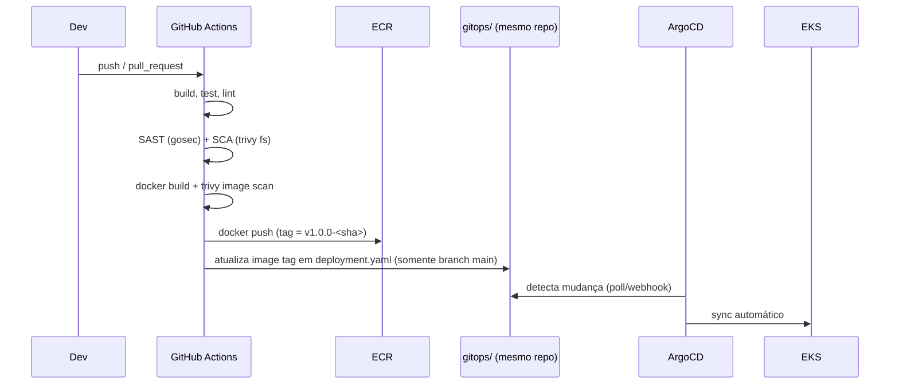

# Arquitetura — ToggleMaster

## Microsserviços

| Serviço      | Responsabilidade                                             | Dependências externas         |
|--------------|---------------------------------------------------------------|--------------------------------|
| `auth`       | Autenticação de clientes/API keys, emissão de JWT             | RDS PostgreSQL (`auth_db`)      |
| `flag`       | CRUD de feature flags                                         | RDS PostgreSQL (`flag_db`)       |
| `targeting`  | Avaliação de regras de segmentação/rollout percentual         | RDS PostgreSQL (`targeting_db`), ElastiCache Redis |
| `evaluation` | Orquestra flag + targeting para decidir o valor final da flag | ElastiCache Redis, SQS (produtor) |
| `analytics`  | Consome eventos de avaliação e agrega métricas                | SQS (consumidor), DynamoDB (`ToggleMasterAnalytics`) |

## Infraestrutura (Terraform)

- **Networking**: 1 VPC, subnets públicas/privadas em 2 AZs, 1 Internet Gateway,
  NAT Gateway (single, configurável), route tables.
- **EKS**: cluster + node group gerenciado (subnets privadas), OIDC provider
  para IRSA, addons `vpc-cni`, `coredns`, `kube-proxy`.
- **IAM**: role do cluster, role do node group, roles IRSA por serviço
  (`evaluation-sa` → SQS `SendMessage`; `analytics-sa` → SQS `ReceiveMessage`/
  `DeleteMessage` + DynamoDB `PutItem`/`Query`), todas criadas via Terraform.
- **Dados**: 3 RDS PostgreSQL (auth/flag/targeting), 1 ElastiCache Redis
  (replication group), 1 tabela DynamoDB (`ToggleMasterAnalytics`, on-demand).
- **Mensageria**: 1 fila SQS + DLQ (`togglemaster-analytics-events[-dlq]`).
- **Registries**: 5 repositórios ECR (um por serviço) com scan-on-push.
- **GitOps**: ArgoCD instalado via provider Helm, `Application` por serviço
  apontando para `gitops/apps/<serviço>`.

## Fluxo de CI/CD

## Segurança (DevSecOps)

- Nenhuma credencial em arquivos versionados; segredos via AWS Secrets Manager
  + Kubernetes Secrets sincronizados por script.
- Autenticação AWS no CI via OIDC (`aws-actions/configure-aws-credentials`),
  sem access keys de longa duração armazenadas em Secrets do GitHub.
- Gate de bloqueio: qualquer achado `CRITICAL` do Trivy (SCA/imagem) interrompe
  o pipeline antes do build/push da imagem.
- Imagens Docker `distroless`/multi-stage, sem shell e rodando como usuário
  não-root.
